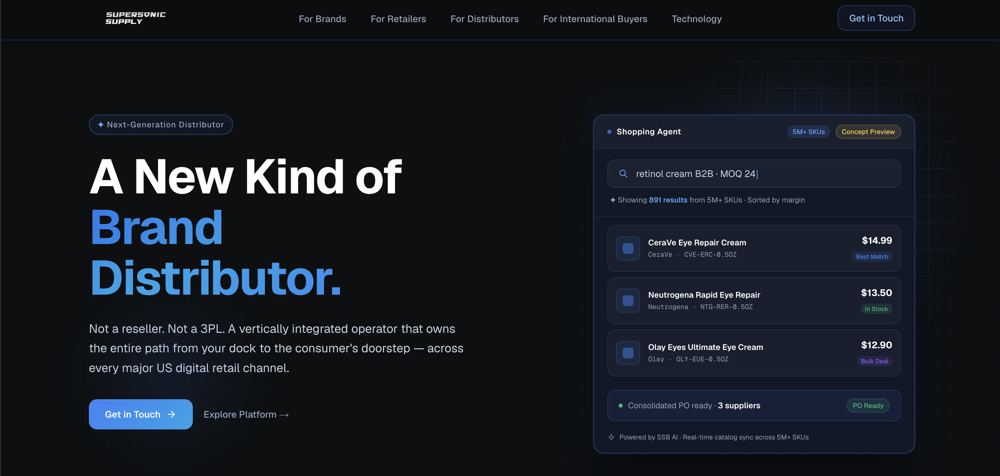

# SSB Website — UI Challenge Submission

Marketing website for **Supersonic Supply (SSB)**, a next-generation US brand distributor. Built as a front-end engineering and product thinking challenge. **[→ Live Demo](https://ssb-website-three.vercel.app/)**



---

## Deliverables

| Page | Route | Status |
|------|-------|--------|
| Homepage | `/` | ✅ |
| For Brands | `/for-brands` | ✅ |
| Technology | `/technology` | ✅ |
| Contact | `/contact` | ✅ |

---

## What Was Built

**Foundation**
- Global design system: color hierarchy, typography scale (`clamp()`-based tokens), spacing
- Navbar with active state, desktop nav, and mobile hamburger overlay (`AnimatePresence`, scroll lock, Escape key, route-change auto-close)

**Pages**
- Homepage: Hero with Shopping Agent mockup, Metrics Bar, Pillars, audience routing strip, CTA
- For Brands: Hero with bouncing physics orbs, Services Grid, CTA
- Technology: Hero, Metrics Bar, AI Agent Cards, CTA
- Contact: Form with ambient glow treatment

**Interactions**
- `useBouncingOrb` — custom hook using `useAnimationFrame` + velocity vectors + wall-reflection physics; delta-capped at 50ms to prevent jumps after tab switches; pauses on `prefers-reduced-motion`
- `AnimatedStat` — framer-motion imperative `animate()` counter with `useState(finalValue)` fallback; never shows 0 on slow connections or IntersectionObserver misses
- `GradientButton` shared component with `size` and `className` props
- Staggered `fadeUp` entrance animations across all sections

**Responsive**
- Verified at 375px / 768px / 1440px
- Shopping Agent mockup hidden on mobile (UX decision — see Decisions below)
- ServicesGrid: equal-width 3-col on desktop, 2-col on tablet (orphan-free), 1-col on mobile

---

## Decisions & Trade-offs

### Shopping Agent mockup: honesty over wow factor
The mockup uses interactive-looking elements (search bar, results list, "Order Now"). Chose to clearly frame it as a `Concept Preview` and remove the false affordances — in a B2B context, a "broken" interactive element damages credibility more than a clearly-labelled static demo.

The alternative (adding micro-interactions and switchable query presets) would be the version to ship on a live product page, but is out of scope for a challenge submission. Documented in [What I'd Do Next](#what-id-do-next).

### Shopping Agent mockup: hidden on mobile
On desktop/tablet, the mockup is part of a two-column hero composition. On mobile (single column), it appears *after* the CTA with no compositional context — a static, non-interactive panel the user may expect to interact with. The hero narrative is complete at the CTA; the mockup is additive on larger screens, not essential on mobile.

→ Full rationale in [`CONTENT_DECISIONS.md`](./CONTENT_DECISIONS.md)

### ServicesGrid: accent line over col-span
Initial implementation gave "US Full-Channel E-commerce" a `col-span-2` at tablet to signal importance. Design review flagged it as a structural error — content volume doesn't justify extra width, and the imbalanced layout read as a CSS mistake rather than intentional hierarchy.

Revised to equal-width 3-col grid. The blue top accent line (`box-shadow: inset 0 2px 0 #3B82F6`) carries the "featured" signal without changing card dimensions. Signal through colour, not structure.

→ Full rationale in [`CONTENT_DECISIONS.md`](./CONTENT_DECISIONS.md)

### `useBouncingOrb` over CSS animation
CSS `@keyframes` can't do wall-reflection physics. The hook uses `useAnimationFrame` with velocity vectors and boundary detection. Upper bounds clamped with `Math.max(0, dimension - orbSize)` to prevent negative travel space causing every-frame velocity flip (orb flicker at small container sizes).

### AnimatedStat: fallback-first counter
`useMotionValue(0)` as initial state meant any IntersectionObserver miss — slow connection, SSR, mid-page navigation — would leave the metric stuck at "0". Changed to `useState(numericValue)` so the correct number is always visible; the count-up animation is a progressive enhancement, not a requirement.

### Brief data inconsistencies: document, don't silently fix
The source brief contained four distinct SKU figures (340K / 753K / 4.32M / 5M+), a conflicting AI agent count (7 claimed, 4 with real content), and an internal contradiction in refinery.ai's dimension count (8 vs 11 dimensions). Documented in [`REVIEW_NOTES.md`](./REVIEW_NOTES.md) rather than silently corrected — numbers originate from the business and any change requires business verification, not a frontend judgment call.

---

## What I'd Do Next

**1. Homepage narrative restructure (JTBD/PAS)**
The current homepage lists capabilities. A stronger structure leads with the customer's problem — "Your brand is on 14 channels. You control none of them." — then presents SSB as the answer, backed by the metrics as proof, with the Shopping Agent as the concrete demonstration. This is the structure Stripe, Linear, and Vercel use: problem → approach → evidence → product → CTA.

**2. Domain-specific visual identity**
The current visual language (dark background, blue accents, geometric grid) could belong to any B2B SaaS. SSB is a physical-goods distributor. A faint network topology illustration (5–8% opacity, nodes = channels, edges = logistics paths) in the Hero background would anchor the brand in its actual domain without being literal or heavy-handed.

**3. Hero typography with a point of view**
Pairing a variable serif (Instrument Serif, Fraunces) for the H1 with the current sans-serif body would give the brand a typographic identity that's harder to copy and easier to remember. Needs validation against the token system and loading budget.

**4. Shopping Agent: switchable query presets**
Three preset buttons ("Anti-aging under $15 B2B" / "Wireless earbuds bulk Q4" / "Kids toys MOQ 24") each mapping to different hardcoded result sets. The mockup stays clearly labelled as a demo but becomes a narrative tool — evaluators can see how the agent handles different sourcing scenarios.

---

## Tech Stack

| Layer | Choice | Reason |
|-------|--------|--------|
| Framework | Next.js 15 (App Router) | Per challenge spec |
| Language | TypeScript | Type safety, zero `tsc` errors enforced |
| Styling | Tailwind CSS + CSS custom properties | Utility classes + design token system |
| Animation | Framer Motion | `useAnimationFrame` physics loop, `AnimatePresence` |
| Icons | Lucide React | Consistent stroke-weight icon system |

---

## QA Sign-off

### Lighthouse (production — `ssb-website-three.vercel.app`)

| Category | Score |
|----------|-------|
| Performance | 91 ✅ |
| Accessibility | 96 ✅ |
| Best Practices | 100 ✅ |
| SEO | 100 ✅ |

Raw report: [`docs/lighthouse.json`](./docs/lighthouse.json)

### Verified breakpoints

| Breakpoint | Width | Result |
|------------|-------|--------|
| Mobile | 375px | ✅ Pass |
| Tablet | 768px | ✅ Pass |
| Desktop | 1440px | ✅ Pass |
| Legacy mobile | 320px | ⚠️ Not supported (below minimum) |

### Known limitations
- **Minimum supported width: 375px.** 320px (iPhone SE 1st gen, 2016) is not in scope — market share < 1% for target B2B audience.
- **Touch hover states.** `onMouseEnter` / `onMouseLeave` handlers do not fire on touch devices. Cards and nav links will not show hover styles on mobile. This is a browser limitation, not a bug.
- **Agent 05–07 placeholder content.** Brief provided content for 4 AI agents only; 3 entries are labelled "Coming Soon" per the source material.
- **TypeScript:** `npx tsc --noEmit` passes with zero errors.

---

## Getting Started

```bash
npm install
npm run dev
```

Open [http://localhost:3000](http://localhost:3000).

**Recommended verification breakpoints** (Chrome DevTools):
```
375px → Mobile
768px → Tablet
1440px → Desktop
```

**Type check:**
```bash
npx tsc --noEmit   # zero errors at submission
```
